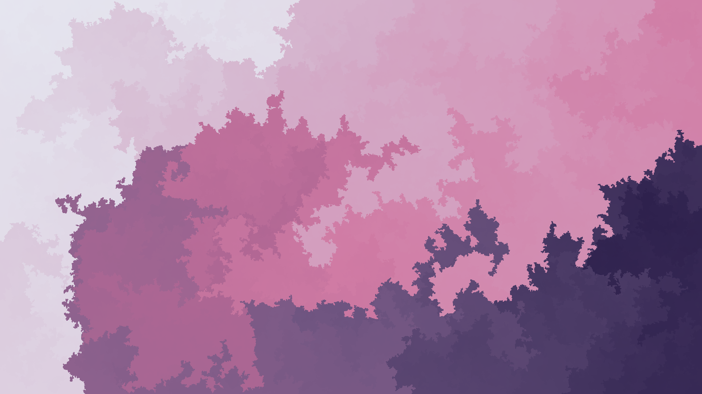

# 'Mazing
Generating, visualising, playing around with mazes


## What is this?
My first project to learn Git.

Mazes are fun, so I wrote up some code to build arbitrarily large ones--and nothing easier for a computer than to solve them, too!

I liked ASCII art visualize them, but PNG is nice too, especially to color stuff. (Along the way animated GIFs also found their way into this.)

In essence, the main `mazing` module provides a handy `Maze` class to work with.


## How is it used?
Run [`playground.py`](./playground.py) as main to directly try most stuff out!
(I put some small effort into making it usable, too)

*Direct usage:*
I tried adding consistent [Google-style docstrings](https://google.github.io/styleguide/pyguide.html#38-comments-and-docstrings) to everything including the main [`mazing.py`](./mazing.py).
Also see code examples in section further below.


## What can it do?
Features of interest include but are not limited to:
- **Carving** random (so-called) 'perfect' mazes with unique solution.
    * Standard algorithms *(Growing tree, backtracker, (simplified) Prim's, Kruskal's, Wilson's, divide-and-conquer)*
    * Mix of different methods *('X'-divide-and-conquer)*
- **Text art.**
    * 7 different ways to print maze as text (3 with solution path)
- **Imaging.**
    * Normal PNG
    * Indicate solution path
    * Colored by distance from entrance (heatmap)
    * Colored by algorithm used (for mixed maze generation)
- **Animation.**
    * Use any of above imaging methods to visualize building of a maze
- **Computing information.**
    * Solution path
    * Longest possible path through maze and other stats


## Don't you have exams to write?
Messing with mazes is tons of fun, and their [graph algorithms](http://www.jamisbuck.org/presentations/rubyconf2011/index.html) are interesting, also [ASCII art](https://en.wikipedia.org/wiki/ASCII_art) is cool, and, then I uh, kinda got lost learning about different [color systems](https://bottosson.github.io/posts/oklab/) and [good scientific heatmap colors](https://www.youtube.com/watch?v=o9KxYxROSgM) too, and, and understanding [Python decorators](https://stackoverflow.com/questions/308999/what-does-functools-wraps-do) was kinda good, so uh....


# Gallery

## Text Art
Mazes for the console!

### ASCII Art
- *ASCII 'frame'*
```
+   +---+---+---+---+---+---+---+---+---+
|               |                       |
+   +---+   +   +---+---+---+   +---+   +
|   |   |   |       |           |       |
+   +   +   +---+   +   +---+---+   +---+
|       |   |           |               |
+   +---+   +   +---+---+---+---+---+   +
|   |       |   |   |           |   |   |
+   +   +---+   +   +   +---+   +   +   +
|   |       |       |   |       |   |   |
+   +---+   +---+---+   +   +---+   +   +
|   |   |           |   |           |   |
+   +   +---+---+   +   +---+---+---+   +
|   |       |       |               |   |
+   +   +   +   +---+---+---+---+   +   +
|   |   |   |   |           |       |   |
+   +   +   +   +   +   +   +   +---+   +
|   |   |   |       |   |   |   |   |   |
+   +---+   +---+---+   +---+   +   +   +
|                   |           |       |
+---+---+---+---+---+---+---+---+---+   +
```
- *'Minimalist' ASCII frame*
```
, ______________________________,
| ,__ |___, |_, , , |___, |___, |
| | , , ,_| __| |_|_, | | __, | |
|_|_| | |__ __|__ | | , | , | , |
| |__ | |___, | ,_| __|___| |_| |
| ,___| | __|__ | | , | ____|_, |
| |__ |_| ________|_|_|___| __| |
| ____| ,_, __| , , |____ ,__ | |
|____ |_| | , |_| |__ , , |_____|
| |_, | ,___|_| |_| , |_|_| ____|
| ,_|__ | | ,__ | ,_|_| | |__ | |
| | | __, ,_| __|_| |_, , |__ , |
| , | , | |__ , |__ __| |__ , | |
| | ,_| |_| , | , __, ,_| __|_| |
| |_| |_| |_| | |_, | | |__ __|_|
| ,__ | , |___|_| |_| | , ,__ __|
|_|_____|___|_________|_|_|____ |
```

### Unicode Art
> *Note: Unfortunately it may happen that certain special characters don't display correctly (uneven character width)*

<details markdown=1><summary>Show Unicode arts</summary>

- *'Frame'* (box drawing characters)
```
╷ ┌───────────┬─────────────┬───┐
│ ╵ ╷ ┌───┬─╴ └───╴ ╷ ┌─────┘ ╷ │
│ ╶─┼─┘ ╷ └───────┐ ├─┘ ╷ ╶─┬─┘ │
├─╴ │ ╶─┼─────┬─╴ │ │ ┌─┴─╴ │ ┌─┤
│ ╷ └─╴ ├─╴ ╶─┤ ╶─┴─┘ ├─┬───┘ │ │
│ ├─────┤ ┌─┐ └───┬───┘ │ ╶─┬─┘ │
│ │ ╶───┘ │ └───┐ │ ╶───┴─┐ │ ╶─┤
│ │ ╶─┬─┬─┴─╴ ┌─┘ │ ┌───┐ ╵ ├─╴ │
│ └─┐ │ │ ╷ ╶─┴─┬─┘ └─┐ └─┐ ╵ ╷ │
├─╴ │ ╵ │ └───┐ └───┐ ├─╴ └─┬─┘ │
│ ╷ │ ╷ │ ┌─╴ ├─┬─┬─┘ │ ┌───┤ ┌─┤
│ │ └─┤ │ ├─┐ ╵ │ │ ╶─┘ └─┐ ╵ │ │
│ ├─┐ ╵ ╵ │ │ ╶─┤ └───────┼─┬─┘ │
│ │ │ ┌─╴ │ ├─╴ │ ┌───╴ ╷ ╵ │ ╷ │
│ │ │ │ ┌─┘ │ ┌─┘ └─┐ ╶─┴─┬─┴─┘ │
│ ╵ │ └─┘ ┌─┘ └───╴ ├───╴ └─╴ ╷ │
└───┴─────┴─────────┴─────────┘ ╵
```
- *'Half-block'*
```
█ ▀▀█▀▀▀▀▀▀▀█▀▀▀█▀▀▀█▀▀▀█▀▀▀▀▀▀▀█
█▀▀ ▀▀▀ █▀▀ ▀▀▀ █▀▀ ▀ ▀▀█▀▀ █▀▀ █
█▀▀▀▀ ▀▀█▀▀▀▀ ▀▀█▀▀ █▀▀▀█▀▀ █▀▀▀█
█▀▀ █▀▀ █▀▀ █ ▀▀▀ ▀▀▀ ▀▀▀ ▀▀▀▀▀ █
█▀▀▀▀▀▀ █▀▀▀▀▀▀▀█ ▀▀█▀▀▀▀▀▀▀█▀▀▀█
█ ▀▀█ ▀▀█▀▀ █▀▀ █▀▀ ▀▀▀ █▀▀ ▀ ▀▀█
█▀▀ █▀▀▀▀▀▀ ▀▀▀▀█▀▀▀█ ▀▀█▀▀▀▀ ▀▀█
█ ▀▀▀▀▀ █▀▀ █ ▀▀█▀▀ ▀ ▀▀█▀▀ █▀▀ █
█▀▀▀▀▀▀▀▀ ▀▀█▀▀▀▀▀▀▀█▀▀▀█▀▀▀█▀▀▀█
█▀▀ █ ▀▀█ ▀▀▀ ▀▀█ ▀▀▀▀▀ ▀ ▀▀▀ ▀▀█
█▀▀ ▀▀▀▀█▀▀▀▀▀▀ █▀▀▀▀▀▀ █ ▀▀▀▀▀▀█
█▀▀ █ ▀▀█▀▀ █ ▀▀█▀▀ █▀▀ █▀▀ █▀▀ █
█▀▀ ▀▀▀▀█▀▀▀█▀▀▀█▀▀ █▀▀▀█▀▀▀█▀▀▀█
█▀▀ █ ▀▀█▀▀ ▀▀▀ █▀▀ ▀ ▀▀▀ ▀▀▀▀▀ █
█▀▀▀█ ▀▀▀▀▀ █▀▀▀█ ▀▀▀▀▀▀█▀▀▀█▀▀ █
█▀▀ ▀▀▀ █ ▀▀▀▀▀ █▀▀ █▀▀ █▀▀ ▀▀▀ █
▀▀▀▀▀▀▀▀▀▀▀▀▀▀▀▀▀▀▀▀▀▀▀▀▀ ▀▀▀▀▀▀▀
```
- *'Quarter-block'*
```
▛▀▀▀▀▀▛▀▀▀▀▀▀▛▀▀▀▀▀▀▛▀▀▀▀▀▀▀▀▀▀▀▌
▌▘▌▀▀▘▌▀▘▀▌▛▘▌▌▘▛▀▘▌▘▛▘▛▀▘▌▀▌▀▘▘▌
▛▀▌▌▌▀▀▀▀▌▘▘▌▌▀▀▘▀▌▀▀▘▌▘▌▌▛▘▀▛▘▌▌
▌▌▘▌▀▀▌▀▘▀▘▀▘▛▘▛▘▌▛▘▛▀▛▘▘▌▘▀▘▘▀▘▌
▌▀▌▛▘▌▘▌▀▀▘▀▀▌▀▌▛▘▌▘▘▘▘▌▀▌▘▌▀▀▀▌▌
▌▘▘▌▌▀▘▌▘▛▘▌▌▀▘▘▌▘▀▌▛▘▛▘▌▀▛▀▘▌▘▘▌
▌▛▀▘▌▀▘▌▘▌▘▘▘▀▛▘▘▀▌▘▌▌▘▀▌▌▘▌▀▀▘▀▌
▌▘▛▀▀▀▛▘▀▛▘▌▀▘▘▀▌▘▀▛▘▛▀▘▘▛▀▀▌▘▌▘▌
▛▀▘▘▌▘▌▘▌▌▌▛▀▘▘▌▀▀▌▌▘▘▀▀▀▌▀▘▘▌▀▀▌
▌▀▀▌▀▌▀▛▘▘▌▘▌▀▀▀▘▌▘▌▀▀▀▘▌▀▘▌▀▀▀▌▌
▌▀▘▀▘▌▘▌▛▀▌▌▀▛▘▛▀▀▘▌▘▛▀▘▌▀▛▘▌▌▘▌▌
▛▀▌▛▘▌▀▘▘▘▘▌▌▘▌▘▘▛▘▀▀▌▀▛▀▌▌▀▌▌▀▘▌
▌▌▌▌▘▀▀▀▀▌▌▘▘▀▘▛▘▘▛▀▘▀▘▌▘▌▀▘▌▘▌▌▌
▌▌▌▌▀▘▌▘▘▘▀▘▀▌▀▌▌▘▌▛▀▌▀▌▘▌▀▘▌▀▘▘▌
▌▘▘▀▌▘▘▌▀▘▘▛▘▘▘▘▌▀▘▌▌▌▘▀▘▛▘▀▀▀▘▌▌
▌▀▀▘▘▀▀▀▀▘▀▘▘▘▀▀▘▌▀▘▌▘▌▀▘▌▘▀▀▀▘▘▌
▀▀▀▀▀▀▀▀▀▀▀▀▀▀▀▀▀▀▀▀▀▀▀▀▀▀▀▀▀▀▀▀▘
```
- *'Pipes'*
```
┌──────────┐┌──────────────┐┌──────────────────┐
│  ┌┐  ┌┐  ││  ┌────┐  ┌┐  ││  ┌┐  ┌┐  ┌┐  ┌┐  │
│  ││  ││  └┘  │┌───┘  ││  └┘  ││  ││  ││  ││  │
│  ││  ││  ┌┐  ││  ┌───┘│  ┌───┘│  ││  ││  ││  │
│  └┘  ││  ││  └┘  └────┘  │┌───┘  ││  └┘  └┘  │
│  ┌───┘│  ││  ┌┐  ┌───────┘│  ┌───┘└───┐  ┌───┘
│  │┌───┘  ││  └┘  │┌──────┐│  └───────┐│  └───┐
│  ││  ┌───┘└──────┘│  ┌┐  ││  ┌────┐  ││  ┌┐  │
│  └┘  │┌──────────┐│  ││  └┘  └────┘  ││  └┘  │
│  ┌───┘│  ┌┐  ┌┐  ││  ││  ┌────┐  ┌───┘│  ┌───┘
│  └───┐│  ││  ││  ││  ││  └────┘  └───┐│  └───┐
│  ┌┐  ││  ││  ││  ││  ││  ┌┐  ┌┐  ┌┐  ││  ┌┐  │
│  └┘  ││  └┘  └┘  └┘  ││  └┘  ││  ││  └┘  ││  │
│  ┌───┘└───┐  ┌────┐  ││  ┌───┘│  ││  ┌───┘│  │
│  │┌──────┐│  │┌───┘  ││  └───┐│  └┘  │┌───┘  │
│  ││  ┌┐  ││  ││  ┌───┘│  ┌┐  ││  ┌───┘│  ┌┐  │
│  ││  └┘  ││  └┘  │┌───┘  ││  └┘  └───┐│  ││  │
│  ││  ┌┐  ││  ┌┐  ││  ┌───┘│  ┌────┐  ││  ││  │
│  └┘  ││  ││  └┘  ││  │┌───┘  │┌───┘  ││  └┘  │
└───┐  ││  ││  ┌───┘│  ││  ┌┐  ││  ┌───┘│  ┌┐  │
┌───┘  └┘  ││  └───┐│  └┘  └┘  └┘  └────┘  ││  │
│  ┌────┐  │└───┐  ││  ┌┐  ┌┐  ┌┐  ┌┐  ┌───┘│  │
│  └────┘  └────┘  └┘  ││  └┘  └┘  ││  └────┘  │
└──────────────────────┘└──────────┘└──────────┘

```

</details>

## Images

### Practical example


<details><summary>Solution of above maze</summary>


</details>

<details><summary>Distance heatmap of maze</summary>


</details>

### Bigger samples





## Animations

### Different Algorithm Timelapses

<details><summary>Backtracker</summary>


</details>


<details><summary>Growing-Tree</summary>


</details>


<details><summary>Prim</summary>


</details>


<details><summary>Kruskal</summary>


</details>


<details><summary>Divide and Conquer</summary>


</details>

### Mixed Divide-and-Conquer Timelapse

<details><summary>Open Animation</summary>

<div style="position:relative">


</div>

</details>


# Helper Modules

While developing this project I had to come up with some functionality best factored out into different modules.

- `colortools` - Homebrewn color module.
    * Loads of useful color constants
    * Interpolation functions
    * Color gradient presets
    * Conversion between color systems
- `benchtools` - Timing decorators.
    * `timed`
    * `timed_titled` for lambdas


# Code Examples

<details><summary>Generate a simple maze and print it to console (Unicode & ASCII).</summary>

```py
from mazing import Maze

# Blank, new maze
my_maze = Maze(16,16)

# Randomize maze
my_maze.backtracker()

# Choose an Unicode string function
print(my_maze.str_frame())

# Choose an ASCII string function
print(my_maze.str_frame_ascii())
```

</details>

<details><summary>Generate a large maze and save a normal- and a solution image in current directory.</summary>

```py
from mazing import Maze

# Blank, new maze
my_maze = Maze(100,100)

# Randomize maze
my_maze.growing_tree()

# Generate normal image, then save it
img = my_maze.generate_image()
img.save(img1.filename)

# Generate solution image, then save it
imgsol = my_maze.generate_solutionimage()
imgsol.save(img1.filename)
```

</details>

<details><summary>Generate an animation of how a maze gets built.</summary>

```py
from mazing import Maze

# Generate animation frames
(frames, my_unused_maze) = Maze.generate_animation(16,16, Maze.backtracker)

# Save frames as .gif
frames[0].save(
    frames[0].filename,
    save_all=True,
    append_images=frames[1:],
    duration=30,
)
```

</details>

<details><summary>Make very large, rosey maze as desktop wallpaper.</summary>

```py
from mazing import Maze
import colortools as ct

# Blank, new maze
my_maze = Maze(1920,1080) # (<!- Python be slow)

# Randomize maze
my_maze.backtracker()

# Precomputes distances
my_maze.compute_distances()

# Generate image
imgdst = my_maze.generate_colorimage(
    gradient_colors=ct.COLORMAPS['acton'][::-1], # makes bright -> dark
    raster=my_maze.generate_raster(
        wall_air_ratio=(0,1),
        show_distances=True
    )
)

# Save image
imgdst.save(imgdst.filename)
```

</details>

<details><summary>Generate a heterogeneous maze, then stepwise escalate image saving customization.</summary>

```py
from mazing import Maze
import colortools as ct

my_maze = Maze(256,256)
my_maze.xdivision()
# 1) Solution image
imgsol = my_maze.generate_solutionimage()
imgsol.save(imgsol.filename)

# 2) Normal image, altered colors
img = my_maze.generate_image(
    wall_air_colors=(ct.COLORS['sepia'],ct.COLORS['pergament']),
)
img.save(img.filename)

# 3) Algorithms map, raster adapted
imgalg = my_maze.generate_algorithmimage(
    raster=my_maze.generate_raster(
        decolumnated=True,
        wall_air_ratio=(1,2),
        show_algorithms=True,
    ),
)
imgalg.save(imgalg.filename)

# 4) Branch distances, colors and raster adapted
my_maze.compute_branchdistances()
imgdst = my_maze.generate_colorimage(
    gradient_colors=ct.COLORMAPS['redyellowblue'][::-1], # makes bright -> dark
    raster=my_maze.generate_raster(
        decolumnated=True,
        wall_air_ratio=(1,2),
        show_distances=True,
    ),
)
imgdst.save(imgdst.filename)
```

</details>
